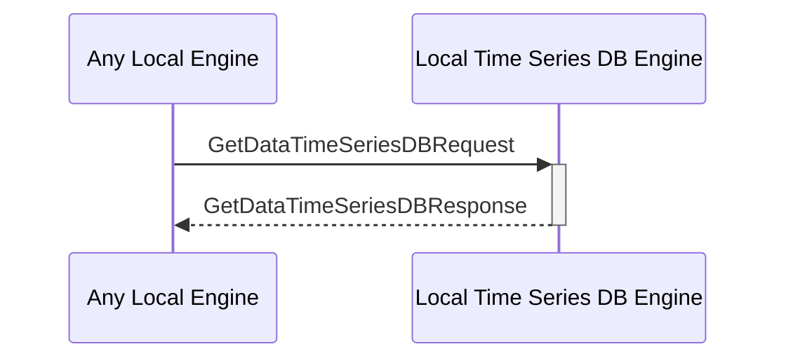

# GetDataTimeSeriesDBResponse

## Purpose

<!-- ANCHOR: purpose -->
Return the queried time series data. 
<!-- ANCHOR_END: purpose -->

## Type

<!-- ANCHOR: type -->
**Reception:**

[[GetDataTimeSeriesDBResponseV1#getdatatimeseriesdbresponsev1]]

{{#include ../types/get-data-time-series-DB-response-v1.md:type}}

**Triggers**

<!-- ANCHOR_END: type -->

## Behavior

<!-- ANCHOR: behavior -->
Return the queried time series data.
<!-- ANCHOR_END: behavior -->

## Message Flow

<!-- ANCHOR: messages -->

<!-- ANCHOR_END: messages -->

