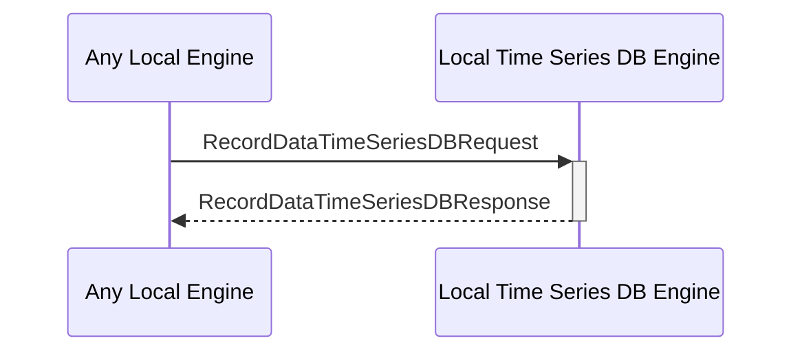

# RecordDataTimeSeriesDBRequest

## Purpose

<!-- ANCHOR: purpose -->
Add time series data to the DB. 
<!-- ANCHOR_END: purpose -->

## Type

<!-- ANCHOR: type -->
**Reception:**

[[RecordDataTimeSeriesDBRequestV1#recorddatatimeseriesdbrequestv1]]

{{#include ../types/record-data-time-series-DB-request-v1.md:type}}

**Triggers**

[[RecordDataTimeSeriesDBResponseV1#recorddatatimeseriesdbresponsev1]]

{{#include ../types/record-data-time-series-DB-response-v1.md:type}}

<!-- ANCHOR_END: type -->

## Behavior

<!-- ANCHOR: behavior -->
Add time series data to the time series DB.
<!-- ANCHOR_END: behavior -->

## Message Flow

<!-- ANCHOR: messages -->

<!-- ANCHOR_END: messages -->

