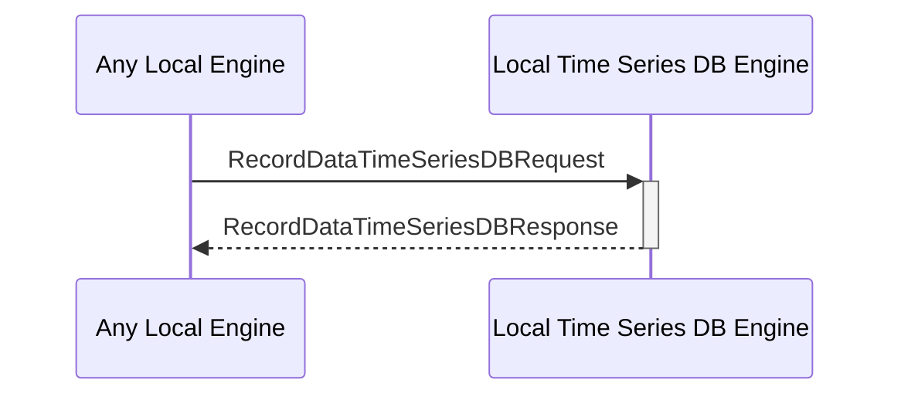

# RecordDataTimeSeriesDBResponse

## Purpose

<!-- ANCHOR: purpose -->
Response to a [[RecordDataTimeSeriesDBRequest#recorddatatimeseriesdbrequest]].
<!-- ANCHOR_END: purpose -->

## Type

<!-- ANCHOR: type -->
**Reception:**

[[RecordDataTimeSeriesDBResponseV1#recorddatatimeseriesdbresponsev1]]

{{#include ../types/record-data-time-series-DB-response-v1.md:type}}

**Triggers**

<!-- ANCHOR_END: type -->

## Behavior

<!-- ANCHOR: behavior -->
Performs the requested data record operation in the time series DB. 
<!-- ANCHOR_END: behavior -->

## Message Flow

<!-- ANCHOR: messages -->

<!-- ANCHOR_END: messages -->

