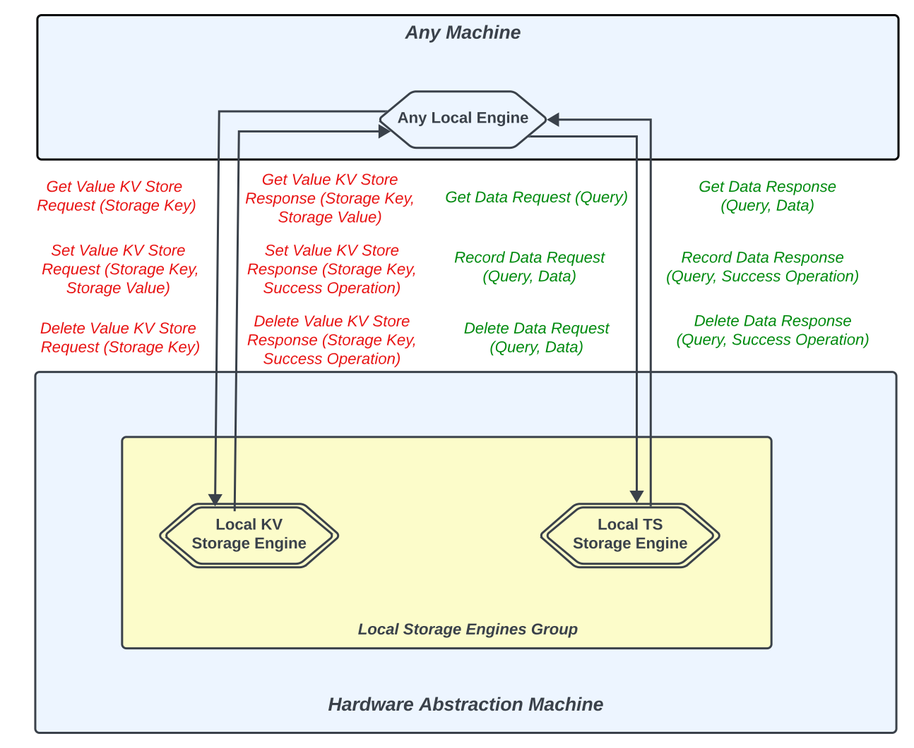
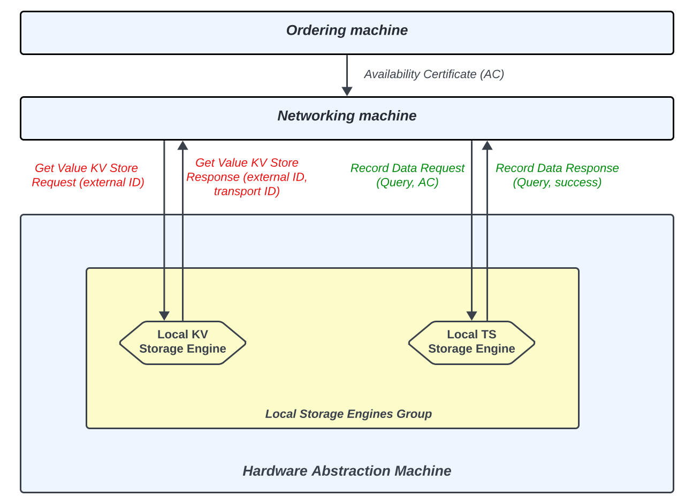

# Local Storage Engines

## Purpose

<!-- --8<-- [start:purpose] -->
The *Local Storage Engines* provide efficient data storage and retrieval mechanisms directly on the physical machine of an Anoma node.
These engines are specialized to meet distinct requirements of data storage and retrieval from other engines. 

<!-- --8<-- [end:purpose] -->

## Background
Local [data storage](https://en.wikipedia.org/wiki/Data_storage) is foundational in modern computing environments. 
It enables direct storage and retrieval of data on hardware without relying on external
networks or resources. Within an Anoma node, the *Local Storage Engines* are manage and use of storage devices
while abstracting away the complexities of the underlying hardware. 

In blockchain environments, various types of data must be stored and made available to other engines upon request.  
This ranges from simple routing data in the [[Networking Machine#networking-machine]] to more complex time series data 
such as transaction batches from the [[Ordering Machine#ordering-machine]].

## Scope

## Functionality
The *Local Storage Engines* provide a flexible and efficient mechanism for storing and retrieving
data in a key-value format on the physical machine an Anoma node is running. 
Key-value storage is suitable for scenarios that require fast data access and low-latency operations that are present in
engines such as [[Static Configuration Engine#static-configuration-engine]].

Additionally, the engines support functionality for time series data, enabling the storage and analysis of time-stamped data points
collected over time interval. Examples include the [[AvailabilityCertificate#availabilitycertificate]].

## Overview
The *Hardware Abstraction Machine* incorporates two specialized storage engines designed to cater to distinct data storage
and retrieval requirements from other engines:
- The [[Local Key-Value Storage Engine#local-key-value-storage-engine]] provides a flexible and efficient mechanism for storing and retrieving
data in a key-value format on the physical machine an Anoma node is running.
Key-value storage is suitable for scenarios that require fast data access and low-latency operations such as
configuration storage.
- The [[Local Time-Series Storage Engine#local-time-series-storage-engine]] is usually optimized for storing and analyzing time-stamped data points
collected over time interval such as [[AvailabilityCertificate#availabilitycertificate]].

## Communication diagram

## Example scenario

The diagram above visualized an example scenario where an Anoma node has generated an [[AvailabilityCertificate#availabilitycertificate]] (AC)
in the [[Ordering Machine#ordering-machine]] that needs to be stored by the Local Storage Engines and sent to other Anoma nodes in the network by the [[Networking Machine#networking-machine]].   
The *Ordering Machine* sends the AC to the [[Router#router]]. The *Router Engine* records the AC in the [[Local Time-Series Storage Engine#local-time-series-storage-engine]] 
and then request the transport identity from one of [[Local Key-Value Storage Engine#local-key-value-storage-engine]] instances that stores routing information. 

## Further reading
