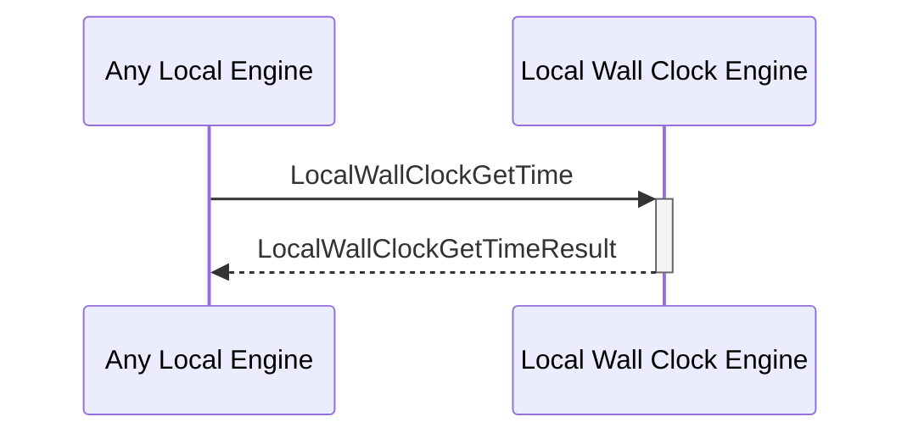

# LocalWallClockGetTime

## Purpose

<!-- --8<-- [start:purpose] -->
Tracks and manages time within the local computing environment.
<!-- --8<-- [end:purpose] -->

## Type

<!-- --8<-- [start:type] -->
**Reception:**

[[LocalWallClockGetTimeV1#localwallclockgettimev1]]

--8<-- "../types/local-wall-clock-get-time-v1.md:type"

**Triggers**

[[LocalWallClockGetTimeResultV1#localwallclockgettimeresultv1]]

--8<-- "../types/local-wall-clock-get-time-result-v1.md:type"

<!-- --8<-- [end:type] -->

## Behavior

<!-- --8<-- [start:behavior] -->
Give the current time according to the physical machine's internal clock system.
<!-- --8<-- [end:behavior] -->

## Message Flow

<!-- --8<-- [start:messages] -->

<!-- --8<-- [end:messages] -->

