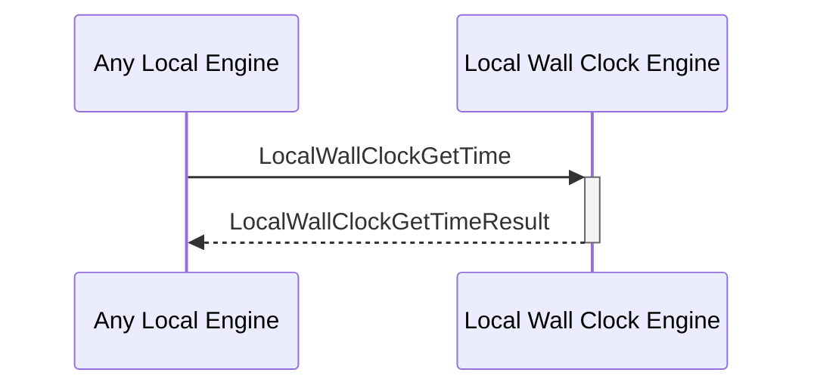

# LocalWallClockGetTime

## Purpose

<!-- ANCHOR: purpose -->
Tracks and manages time within the local computing environment.
<!-- ANCHOR_END: purpose -->

## Type

<!-- ANCHOR: type -->
**Reception:**

[[LocalWallClockGetTimeV1#localwallclockgettimev1]]

{{#include ../types/local-wall-clock-get-time-v1.md:type}}

**Triggers**

[[LocalWallClockGetTimeResultV1#localwallclockgettimeresultv1]]

{{#include ../types/local-wall-clock-get-time-result-v1.md:type}}

<!-- ANCHOR_END: type -->

## Behavior

<!-- ANCHOR: behavior -->
Give the current time according to the physical machine's internal clock system.
<!-- ANCHOR_END: behavior -->

## Message Flow

<!-- ANCHOR: messages -->

<!-- ANCHOR_END: messages -->

