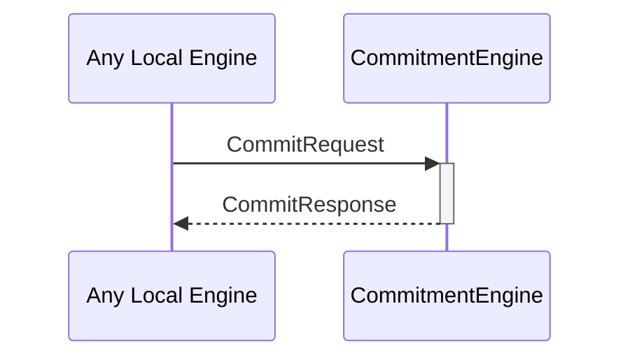

# CommitRequest

# CommitResponse

## Purpose

<!-- --8<-- [start:purpose] -->
A `CommitRequest` instructs a commitment engine instance to produce a commitment by the internal identity corresponding to that engine instance.
<!-- --8<-- [end:purpose] -->

## Type

<!-- --8<-- [start:type] -->
[[CommitRequest]]
[[CommitResponse]]
<!-- --8<-- [end:type] -->

## Behavior

<!-- --8<-- [start:behavior] -->
- Uses the `sign` method on the corresponding `Signer` to generate a commitment
    - Depending on the backend, this may involve I/O to an external device.
- Returns the commitment in a [[CommitResponse]].
<!-- --8<-- [end:behavior] -->

## Message flow

<!-- --8<-- [start:messages] -->

<!-- --8<-- [end:messages] -->

