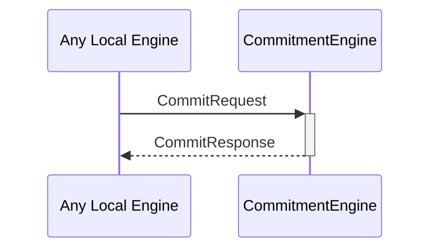

# CommitRequest
# CommitResponse

## Purpose

<!-- ANCHOR: purpose -->
A `CommitRequest` instructs a commitment engine instance to produce a commitment by the internal identity corresponding to that engine instance.
<!-- ANCHOR_END: purpose -->

## Type

<!-- ANCHOR: type -->
[[CommitRequest]]
[[CommitResponse]]
<!-- ANCHOR_END: type -->

## Behavior

<!-- ANCHOR: behavior -->
- Uses the `sign` method on the corresponding `Signer` to generate a commitment
    - Depending on the backend, this may involve I/O to an external device.
- Returns the commitment in a [[CommitResponse]].
<!-- ANCHOR_END: behavior -->

## Message flow

<!-- ANCHOR: messages -->

<!-- ANCHOR_END: messages -->

