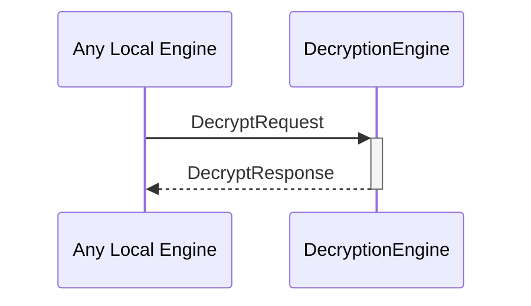

# DecryptRequest
# DecryptResponse

## Purpose

<!-- --8<-- [start:purpose] -->
A `DecryptRequest` instructs a decryption engine instance to decrypt data as the internal identity corresponding to that engine instance.

A `DecryptResponse` contains the data decrypted by a decryption engine instance in response to a [[DecryptRequest]].
<!-- --8<-- [end:purpose] -->

## Type

<!-- --8<-- [start:type] -->
[[DecryptRequest]]
[[DecryptResponse]]
<!-- --8<-- [end:type] -->

## Behavior

<!-- --8<-- [start:behavior] -->
- Uses the `decrypt` method on the corresponding `Decryptor` to decrypt the ciphertext
    - Depending on the backend, this may involve I/O to an external device.
- Returns the commitment in a [[DecryptResponse]].
<!-- --8<-- [end:behavior] -->

## Message flow

<!-- --8<-- [start:messages] -->

<!-- --8<-- [end:messages] -->

