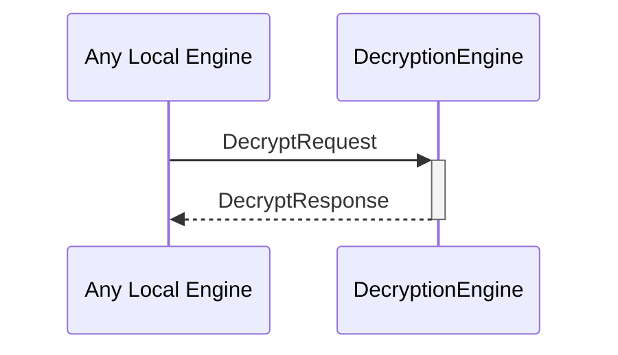

# DecryptRequest
# DecryptResponse

## Purpose

<!-- ANCHOR: purpose -->
A `DecryptRequest` instructs a decryption engine instance to decrypt data as the internal identity corresponding to that engine instance.

A `DecryptResponse` contains the data decrypted by a decryption engine instance in response to a [[DecryptRequest]].
<!-- ANCHOR_END: purpose -->

## Type

<!-- ANCHOR: type -->
[[DecryptRequest]]
[[DecryptResponse]]
<!-- ANCHOR_END: type -->

## Behavior

<!-- ANCHOR: behavior -->
- Uses the `decrypt` method on the corresponding `Decryptor` to decrypt the ciphertext
    - Depending on the backend, this may involve I/O to an external device.
- Returns the commitment in a [[DecryptResponse]].
<!-- ANCHOR_END: behavior -->

## Message flow

<!-- ANCHOR: messages -->

<!-- ANCHOR_END: messages -->

