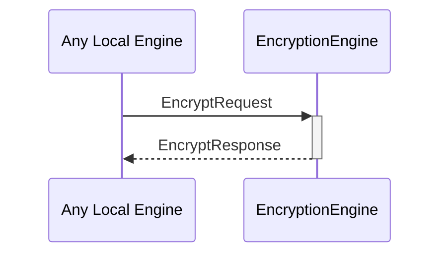

# EncryptRequest

# EncryptResponse

## Purpose

<!-- --8<-- [start:purpose] -->
An `EncryptRequest` instructs an encryption engine to encrypt data to a particular external identity, possibly using known reads-for relationships.

An `EncryptResponse` contains the data encrypted by an encryption engine in response to an [[EncryptRequest]].
<!-- --8<-- [end:purpose] -->

## Type

<!-- --8<-- [start:type] -->
[[EncryptRequest]]
[[EncryptResponse]]
<!-- --8<-- [end:type] -->

## Behavior

<!-- --8<-- [start:behavior] -->
- Calls the `encrypt` method on the provided external identity and returns the result in an [[EncryptResponse]]
- If `useReadsFor` is true, use known reads-for relationships to select the most efficient external identity
- If `useReadsFor` is false, encrypt only to the provided identity
<!-- --8<-- [end:behavior] -->

## Message flow

<!-- --8<-- [start:messages] -->

<!-- --8<-- [end:messages] -->

