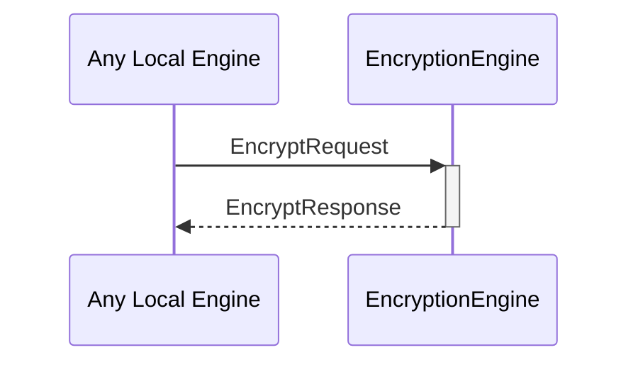

# EncryptRequest
# EncryptResponse

## Purpose

<!-- ANCHOR: purpose -->
An `EncryptRequest` instructs an encryption engine to encrypt data to a particular external identity, possibly using known reads-for relationships.

An `EncryptResponse` contains the data encrypted by an encryption engine in response to an [[EncryptRequest]].
<!-- ANCHOR_END: purpose -->

## Type

<!-- ANCHOR: type -->
[[EncryptRequest]]
[[EncryptResponse]]
<!-- ANCHOR_END: type -->

## Behavior

<!-- ANCHOR: behavior -->
- Calls the `encrypt` method on the provided external identity and returns the result in an [[EncryptResponse]]
- If `useReadsFor` is true, use known reads-for relationships to select the most efficient external identity
- If `useReadsFor` is false, encrypt only to the provided identity
<!-- ANCHOR_END: behavior -->

## Message flow

<!-- ANCHOR: messages -->

<!-- ANCHOR_END: messages -->

