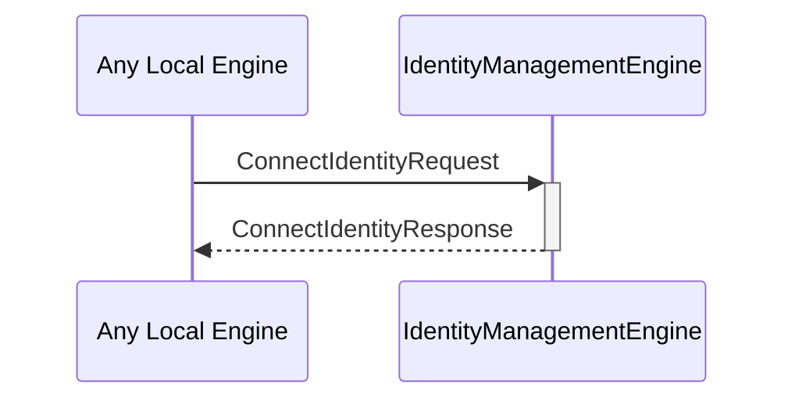

# ConnectIdentityRequest

# ConnectIdentityResponse

## Purpose

<!-- --8<-- [start:purpose] -->
A `ConnectIdentityRequest` instructs the identity management engine to connect an existing identity using the specified backend.

A `ConnectIdentityResponse` provides the handles to decryption and commitment engine instances for a newly connected identity, or an error if a failure occurred.
<!-- --8<-- [end:purpose] -->

## Type

<!-- --8<-- [start:type] -->
[[ConnectIdentityRequest]]
[[ConnectIdentityResponse]]
<!-- --8<-- [end:type] -->

## Behavior

<!-- --8<-- [start:behavior] -->
- Attempts to use the designated backend to connect the specified identity
- Creates new commitment engine and decryption engine instances
- Returns handles to those instances in a [[ConnectIdentityResponse]]
- If a composed identity is requested, where the composed identity cannot be directly connected, attempt to connect the constituent components, compose them, and return the resulting engine instance handles.
<!-- --8<-- [end:behavior] -->

## Message flow

<!-- --8<-- [start:messages] -->

<!-- --8<-- [end:messages] -->

