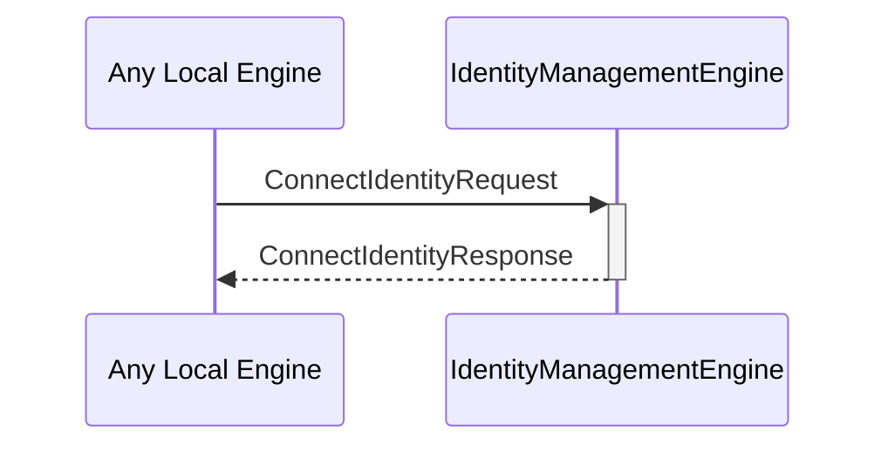

# ConnectIdentityRequest
# ConnectIdentityResponse

## Purpose

<!-- ANCHOR: purpose -->
A `ConnectIdentityRequest` instructs the identity management engine to connect an existing identity using the specified backend.

A `ConnectIdentityResponse` provides the handles to decryption and commitment engine instances for a newly connected identity, or an error if a failure occurred.
<!-- ANCHOR_END: purpose -->

## Type

<!-- ANCHOR: type -->
[[ConnectIdentityRequest]]
[[ConnectIdentityResponse]]
<!-- ANCHOR_END: type -->

## Behavior

<!-- ANCHOR: behavior -->
- Attempts to use the designated backend to connect the specified identity
- Creates new commitment engine and decryption engine instances
- Returns handles to those instances in a [[ConnectIdentityResponse]]
- If a composed identity is requested, where the composed identity cannot be directly connected, attempt to connect the constituent components, compose them, and return the resulting engine instance handles.
<!-- ANCHOR_END: behavior -->

## Message flow

<!-- ANCHOR: messages -->

<!-- ANCHOR_END: messages -->

