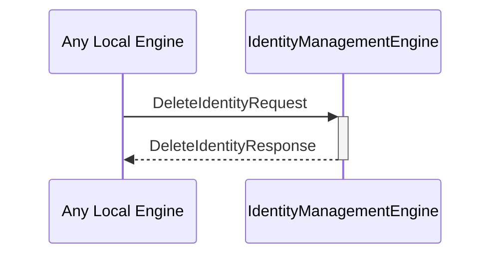

# DeleteIdentityRequest
# DeleteIdentityResponse

## Purpose

<!-- ANCHOR: purpose -->
Describe the purpose of the message.
A `DeleteIdentityRequest` instructs the identity management engine to delete an existing identity using the specified backend.

A `DeleteIdentityResponse` provides the response information from an attempt to delete an identity.
<!-- ANCHOR_END: purpose -->

## Type

<!-- ANCHOR: type -->
[[DeleteIdentityRequest]]
[[DeleteIdentityResponse]]
<!-- ANCHOR_END: type -->

## Behavior

<!-- ANCHOR: behavior -->
- Attempts to use the designated backend to delete the specified identity
  - This will likely involve authentication on the backend
- Returns a [[DeleteIdentityResponse]]
<!-- ANCHOR_END: behavior -->

## Message flow

<!-- ANCHOR: messages -->

<!-- ANCHOR_END: messages -->

