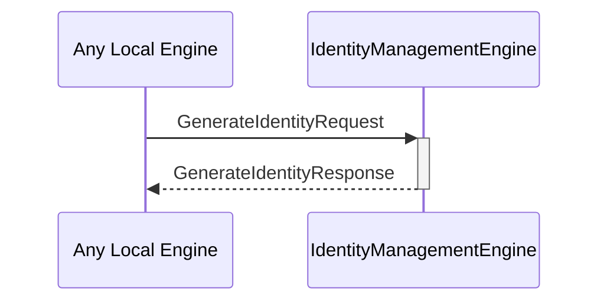

# GenerateIdentityRequest
# GenerateIdentityResponse

## Purpose

<!-- ANCHOR: purpose -->
A `GenerateIdentityRequest` instructs the identity management engine to generate a new identity using the specified backend.

A `GenerateIdentityResponse` provides the handles to decryption and commitment engine instances for a newly generated identity, or an error if a failure occurred.
<!-- ANCHOR_END: purpose -->

## Type

<!-- ANCHOR: type -->
[[GenerateIdentityRequest]]
[[GenerateIdentityResponse]]
<!-- ANCHOR_END: type -->

## Behavior

<!-- ANCHOR: behavior -->
- Uses the designated backend to generate a new identity
- Creates new commitment engine and decryption engine instances
- Returns handles to those instances in a [[GenerateIdentityResponse]]
<!-- ANCHOR_END: behavior -->

## Message flow

<!-- ANCHOR: messages -->

<!-- ANCHOR_END: messages -->

