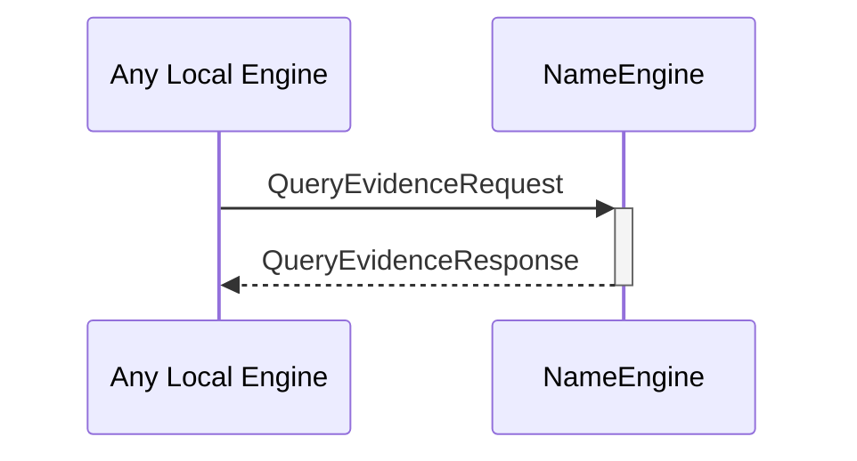

# QueryNameEvidenceRequest
# QueryNameEvidenceResponse

## Purpose

<!-- --8<-- [start:purpose] -->
A `QueryNameEvidenceRequest` instructs the name engine to read and return any known [[IdentityName]]s and [[IdentityNameEvidence]] associated with a specific external identity.

A `QueryNameEvidenceResponse` is returned by the name engine in response to a [[QueryNameEvidenceRequest]].
<!-- --8<-- [end:purpose] -->

## Type

<!-- --8<-- [start:type] -->
[[QueryEvidenceRequest]]
[[QueryEvidenceResponse]]
<!-- --8<-- [end:type] -->

## Behavior

<!-- --8<-- [start:behavior] -->
- Returns all known [[IdentityNameEvidence]] for the [[ExternalIdentity]] provided in the request
<!-- --8<-- [end:behavior] -->

## Message flow

<!-- --8<-- [start:messages] -->

<!-- --8<-- [end:messages] -->

