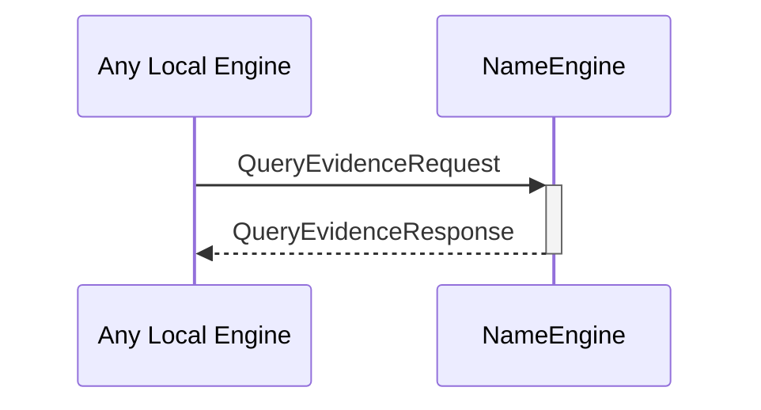

# QueryNameEvidenceRequest
# QueryNameEvidenceResponse

## Purpose

<!-- ANCHOR: purpose -->
A `QueryNameEvidenceRequest` instructs the name engine to read and return any known [[IdentityName]]s and [[IdentityNameEvidence]] associated with a specific external identity.

A `QueryNameEvidenceResponse` is returned by the name engine in response to a [[QueryNameEvidenceRequest]].
<!-- ANCHOR_END: purpose -->

## Type

<!-- ANCHOR: type -->
[[QueryEvidenceRequest]]
[[QueryEvidenceResponse]]
<!-- ANCHOR_END: type -->

## Behavior

<!-- ANCHOR: behavior -->
- Returns all known [[IdentityNameEvidence]] for the [[ExternalIdentity]] provided in the request
<!-- ANCHOR_END: behavior -->

## Message flow

<!-- ANCHOR: messages -->

<!-- ANCHOR_END: messages -->

