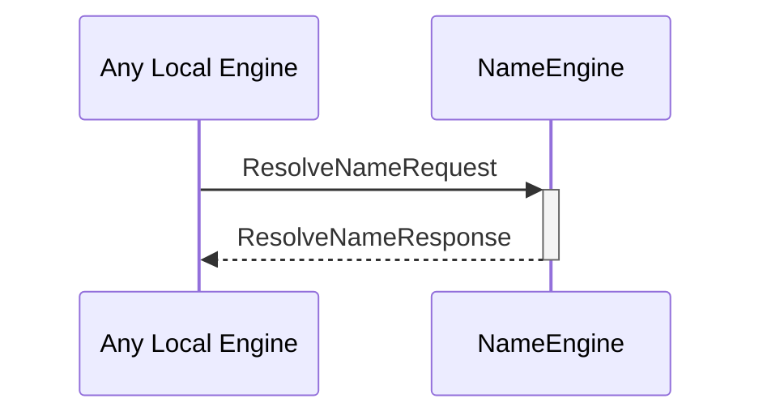

# ResolveNameRequest
# ResolveNameResponse

## Purpose

<!-- --8<-- [start:purpose] -->
A `ResolveNameRequest` asks the name engine which [[ExternalIdentity]]s are associated with a given [[IdentityName]].

A `ResolveNameResponse` is returned in response to a [[ResolveNameRequest]]
<!-- --8<-- [end:purpose] -->

## Type

<!-- --8<-- [start:type] -->
[[ResolveNameRequest]]
[[ResolveNameResponse]]
<!-- --8<-- [end:type] -->

## Behavior

<!-- --8<-- [start:behavior] -->
- Returns all [[ExternalIdentity]]s with [[IdentityNameEvidence]] associated with the resolved [[IdentityName]]
<!-- --8<-- [end:behavior] -->

## Message flow

<!-- --8<-- [start:messages] -->

<!-- --8<-- [end:messages] -->

