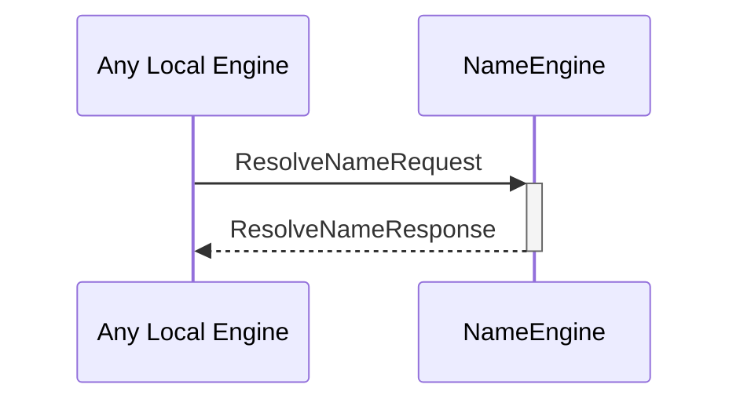

# ResolveNameRequest
# ResolveNameResponse

## Purpose

<!-- ANCHOR: purpose -->
A `ResolveNameRequest` asks the name engine which [[ExternalIdentity]]s are associated with a given [[IdentityName]].

A `ResolveNameResponse` is returned in response to a [[ResolveNameRequest]]
<!-- ANCHOR_END: purpose -->

## Type

<!-- ANCHOR: type -->
[[ResolveNameRequest]]
[[ResolveNameResponse]]
<!-- ANCHOR_END: type -->

## Behavior

<!-- ANCHOR: behavior -->
- Returns all [[ExternalIdentity]]s with [[IdentityNameEvidence]] associated with the resolved [[IdentityName]]
<!-- ANCHOR_END: behavior -->

## Message flow

<!-- ANCHOR: messages -->

<!-- ANCHOR_END: messages -->

