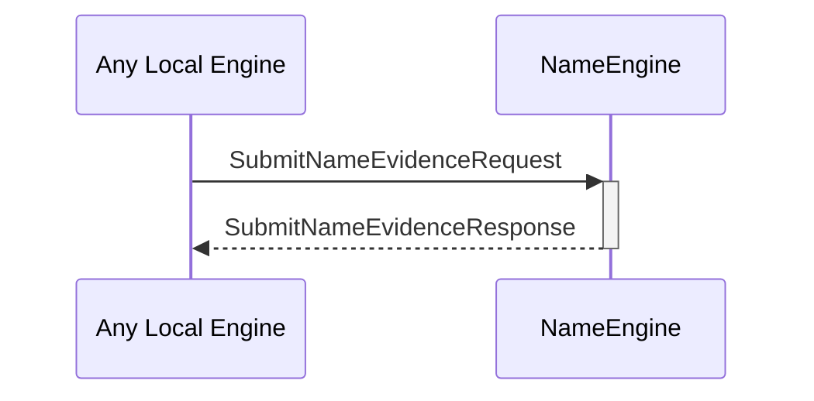

# SubmitNameEvidenceRequest
# SubmitNameEvidenceResponse

## Purpose

<!-- ANCHOR: purpose -->
A `SubmitNameEvidenceRequest` instructs the name engine to store a new piece of [[IdentityNameEvidence]].

A `SubmitNameEvidenceResponse` is sent in response to a [[SubmitNameEvidenceRequest]].
<!-- ANCHOR_END: purpose -->

## Type

<!-- ANCHOR: type -->
[[SubmitNameEvidenceRequest]]
[[SubmitNameEvidenceResponse]]
<!-- ANCHOR_END: type -->

## Behavior

<!-- ANCHOR: behavior -->
Describe the message reception behavior, processing logic, and possible triggers.
- Stores the submitted evidence
- This will affect future [[ResolveNameResponse]]s, as those depend on the set of evidence stored. 
- Returns an error iff:
    - The [[IdentityNameEvidence]] is invalid
    - The [[IdentityNameEvidence]] was already stored
<!-- ANCHOR_END: behavior -->

## Message flow

<!-- ANCHOR: messages -->

<!-- ANCHOR_END: messages -->

