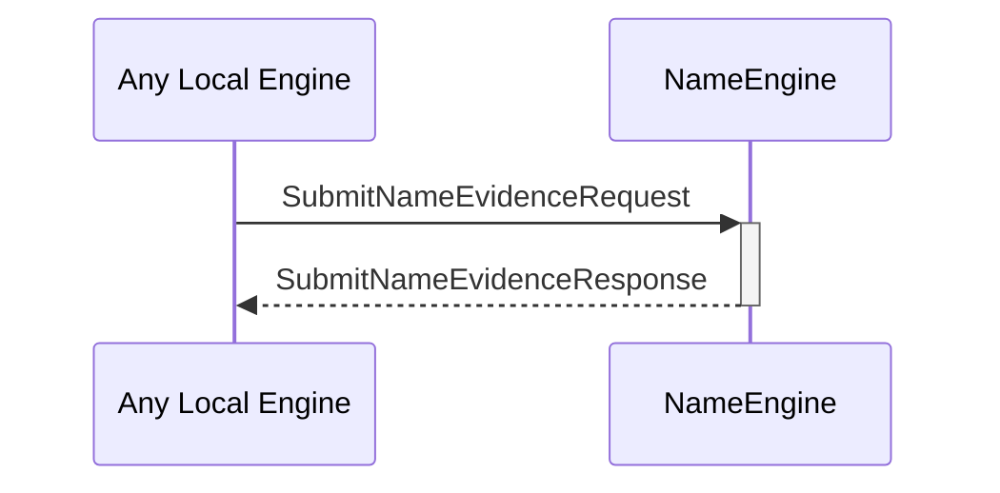

# SubmitNameEvidenceRequest

# SubmitNameEvidenceResponse

## Purpose

<!-- --8<-- [start:purpose] -->
A `SubmitNameEvidenceRequest` instructs the name engine to store a new piece of [[IdentityNameEvidence]].

A `SubmitNameEvidenceResponse` is sent in response to a [[SubmitNameEvidenceRequest]].
<!-- --8<-- [end:purpose] -->

## Type

<!-- --8<-- [start:type] -->
[[SubmitNameEvidenceRequest]]
[[SubmitNameEvidenceResponse]]
<!-- --8<-- [end:type] -->

## Behavior

<!-- --8<-- [start:behavior] -->
Describe the message reception behavior, processing logic, and possible triggers.
- Stores the submitted evidence
- This will affect future [[ResolveNameResponse]]s, as those depend on the set of evidence stored.
- Returns an error iff:
    - The [[IdentityNameEvidence]] is invalid
    - The [[IdentityNameEvidence]] was already stored
<!-- --8<-- [end:behavior] -->

## Message flow

<!-- --8<-- [start:messages] -->

<!-- --8<-- [end:messages] -->

