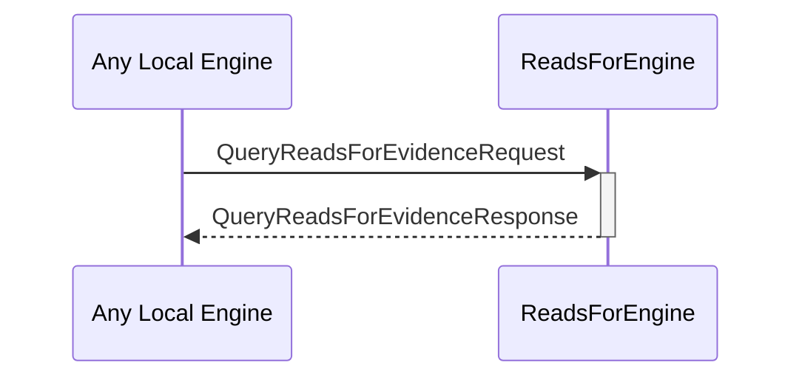

# QueryReadsForEvidenceRequest
# QueryReadsForEvidenceResponse

## Purpose

<!-- ANCHOR: purpose -->
A `QueryReadsForEvidenceRequest` instructs the reads-for engine to read and return the known reads-for evidence associated with a specific external identity.

A `QueryReadsForEvidenceResponse` is returned by the reads-for engine in response to a [[QueryReadsForEvidenceRequest]].
<!-- ANCHOR_END: purpose -->

## Type

<!-- ANCHOR: type -->
[[QueryReadsForEvidenceRequest]]
[[QueryReadsForEvidenceResponse]]
<!-- ANCHOR_END: type -->

## Behavior

<!-- ANCHOR: behavior -->
- Returns known evidence in a [[QueryReadsForEvidenceResponse]]
<!-- ANCHOR_END: behavior -->

## Message flow

<!-- ANCHOR: messages -->

<!-- ANCHOR_END: messages -->

