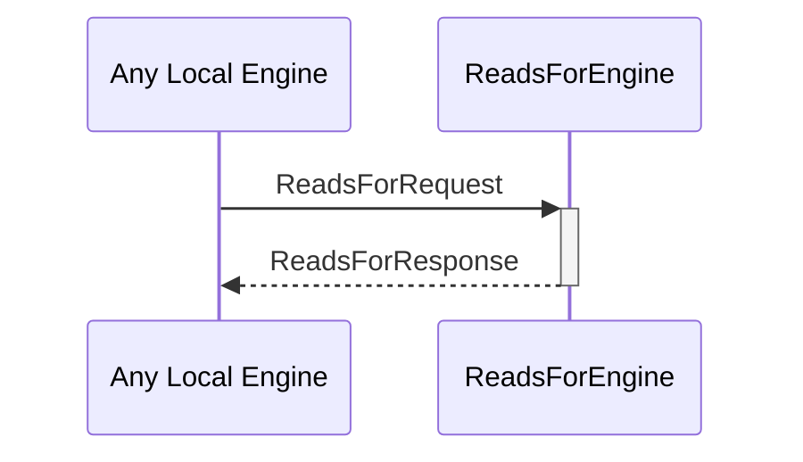

# ReadsForRequest
# ReadsForResponse

## Purpose

<!-- ANCHOR: purpose -->
A `ReadsForRequest` asks the reads-for engine whether one identity can read for another.

A `ReadsForResponse` is returned in response to a [[ReadsForRequest]]
<!-- ANCHOR_END: purpose -->

## Type

<!-- ANCHOR: type -->
[[ReadsForRequest]]
[[ReadsForResponse]]
<!-- ANCHOR_END: type -->

## Behavior

<!-- ANCHOR: behavior -->
- Returns a [[ReadsForResponse]] according to whether A `readsFor` B, given the known evidence
<!-- ANCHOR_END: behavior -->

## Message flow

<!-- ANCHOR: messages -->

<!-- ANCHOR_END: messages -->

