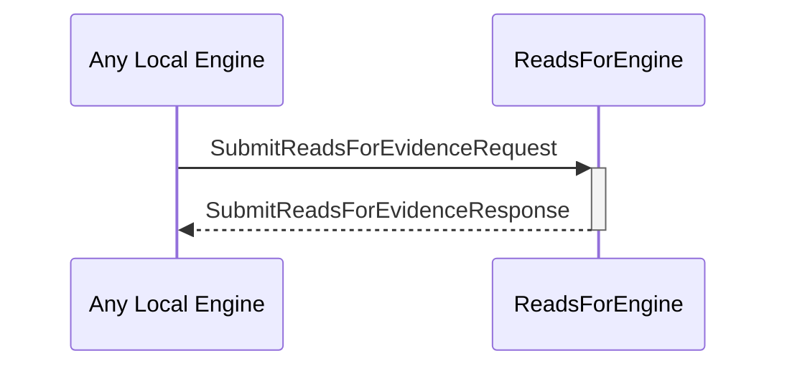

# SubmitReadsForEvidenceRequest
# SubmitReadsForEvidenceResponse

## Purpose

<!-- ANCHOR: purpose -->
A `SubmitReadsForEvidenceRequest` instructs the reads-for engine to store a new piece of reads-for evidence.

A `SubmitReadsForEvidenceResponse` is sent in response to a [[SubmitReadsForEvidenceRequest]].
<!-- ANCHOR_END: purpose -->

## Type

<!-- ANCHOR: type -->
[[SubmitReadsForEvidenceRequest]]
[[SubmitReadsForEvidenceResponse]]
<!-- ANCHOR_END: type -->

## Behavior

<!-- ANCHOR: behavior -->
Describe the message reception behavior, processing logic, and possible triggers.
- Stores the submitted evidence
- Returns an error iff.
    - The evidence is invalid
    - The evidence was already stored
<!-- ANCHOR_END: behavior -->

## Message flow

<!-- ANCHOR: messages -->

<!-- ANCHOR_END: messages -->

