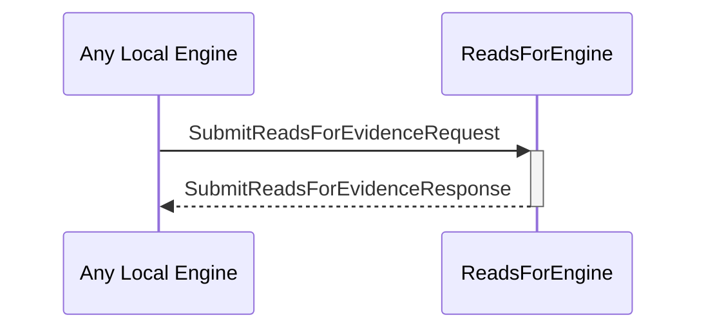

# SubmitReadsForEvidenceRequest
# SubmitReadsForEvidenceResponse

## Purpose

<!-- --8<-- [start:purpose] -->
A `SubmitReadsForEvidenceRequest` instructs the reads-for engine to store a new piece of reads-for evidence.

A `SubmitReadsForEvidenceResponse` is sent in response to a [[SubmitReadsForEvidenceRequest]].
<!-- --8<-- [end:purpose] -->

## Type

<!-- --8<-- [start:type] -->
[[SubmitReadsForEvidenceRequest]]
[[SubmitReadsForEvidenceResponse]]
<!-- --8<-- [end:type] -->

## Behavior

<!-- --8<-- [start:behavior] -->
Describe the message reception behavior, processing logic, and possible triggers.
- Stores the submitted evidence
- Returns an error iff.
    - The evidence is invalid
    - The evidence was already stored
<!-- --8<-- [end:behavior] -->

## Message flow

<!-- --8<-- [start:messages] -->

<!-- --8<-- [end:messages] -->

