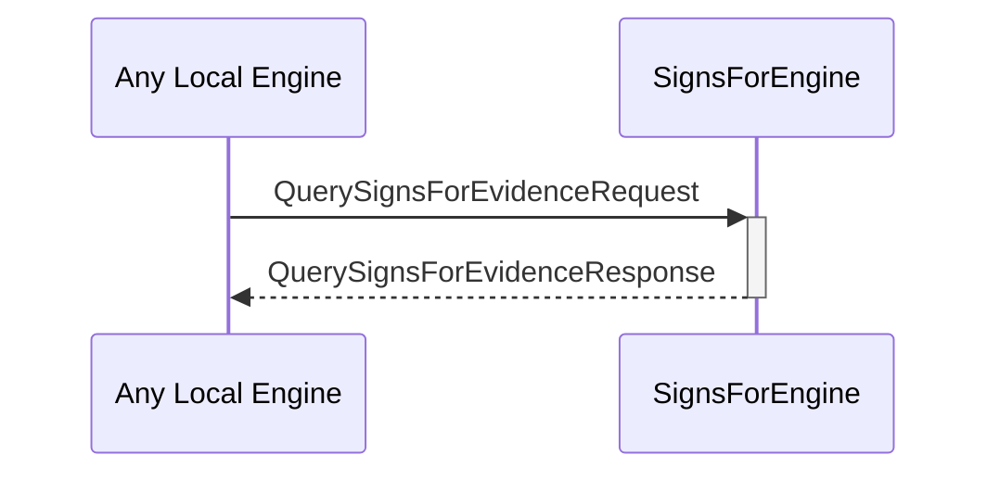

# QuerySignsForEvidenceRequest
# QuerySignsForEvidenceResponse

## Purpose

<!-- ANCHOR: purpose -->
A `QuerySignsForEvidenceRequest` instructs the signs-for engine to read and return the known signs-for evidence associated with a specific external identity.

A `QuerySignsForEvidenceResponse` is returned by the signs-for engine in response to a [[QuerySignsForEvidenceRequest]].
<!-- ANCHOR_END: purpose -->

## Type

<!-- ANCHOR: type -->
[[QuerySignsForEvidenceRequest]]
[[QuerySignsForEvidenceResponse]]
<!-- ANCHOR_END: type -->

## Behavior

<!-- ANCHOR: behavior -->
- Returns known evidence in a [[QuerySignsForEvidenceResponse]]
<!-- ANCHOR_END: behavior -->

## Message flow

<!-- ANCHOR: messages -->

<!-- ANCHOR_END: messages -->

