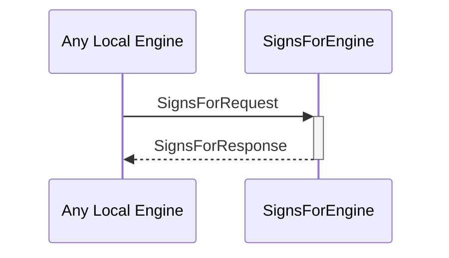

# SignsForRequest
# SignsForResponse

## Purpose

<!-- ANCHOR: purpose -->
A `SignsForRequest` asks the signs-for engine whether one identity can signs for another.

A `SignsForResponse` is returned in response to a [[SignsForRequest]]
<!-- ANCHOR_END: purpose -->

## Type

<!-- ANCHOR: type -->
[[SignsForRequest]]
[[SignsForResponse]]
<!-- ANCHOR_END: type -->

## Behavior

<!-- ANCHOR: behavior -->
- Returns a [[SignsForResponse]] according to whether A `signsFor` B, given the known evidence
<!-- ANCHOR_END: behavior -->

## Message flow

<!-- ANCHOR: messages -->

<!-- ANCHOR_END: messages -->

