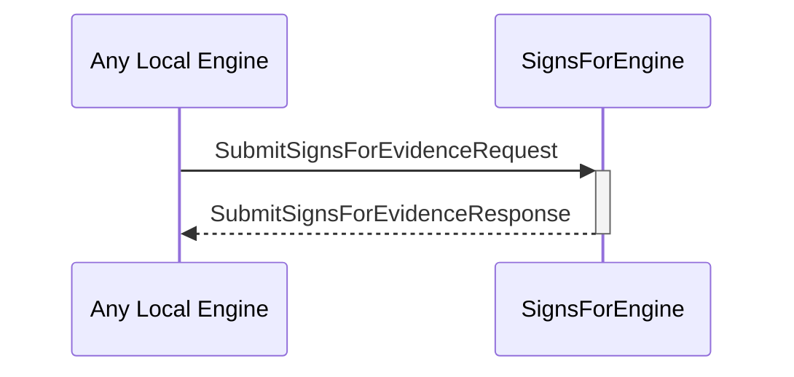

# SubmitSignsForEvidenceRequest
# SubmitSignsForEvidenceResponse

## Purpose

<!-- ANCHOR: purpose -->
A `SubmitSignsForEvidenceRequest` instructs the signs-for engine to store a new piece of signs-for evidence.

A `SubmitSignsForEvidenceResponse` is sent in response to a [[SubmitSignsForEvidenceRequest]].
<!-- ANCHOR_END: purpose -->

## Type

<!-- ANCHOR: type -->
[[SubmitSignsForEvidenceRequest]]
[[SubmitSignsForEvidenceResponse]]
<!-- ANCHOR_END: type -->

## Behavior

<!-- ANCHOR: behavior -->
- Stores the submitted evidence
- Returns an error iff.
    - The evidence is invalid
    - The evidence was already stored
<!-- ANCHOR_END: behavior -->

## Message flow

<!-- ANCHOR: messages -->

<!-- ANCHOR_END: messages -->

