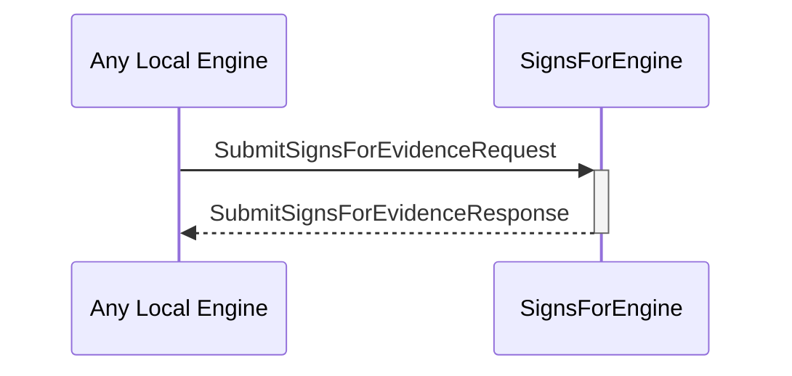

# SubmitSignsForEvidenceRequest

# SubmitSignsForEvidenceResponse

## Purpose

<!-- --8<-- [start:purpose] -->
A `SubmitSignsForEvidenceRequest` instructs the signs-for engine to store a new piece of signs-for evidence.

A `SubmitSignsForEvidenceResponse` is sent in response to a [[SubmitSignsForEvidenceRequest]].
<!-- --8<-- [end:purpose] -->

## Type

<!-- --8<-- [start:type] -->
[[SubmitSignsForEvidenceRequest]]
[[SubmitSignsForEvidenceResponse]]
<!-- --8<-- [end:type] -->

## Behavior

<!-- --8<-- [start:behavior] -->
- Stores the submitted evidence
- Returns an error iff.
    - The evidence is invalid
    - The evidence was already stored
<!-- --8<-- [end:behavior] -->

## Message flow

<!-- --8<-- [start:messages] -->

<!-- --8<-- [end:messages] -->

