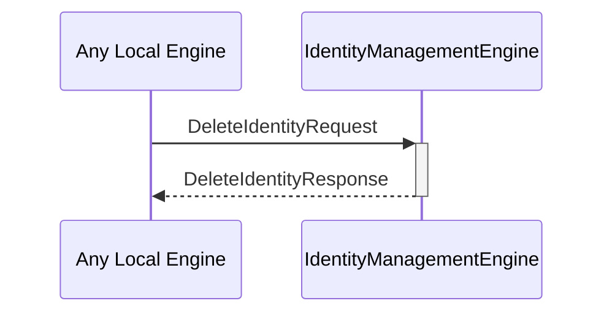

# DeleteIdentityRequest

# DeleteIdentityResponse

## Purpose

<!-- --8<-- [start:purpose] -->
Describe the purpose of the message.
A `DeleteIdentityRequest` instructs the identity management engine to delete an existing identity using the specified backend.

A `DeleteIdentityResponse` provides the response information from an attempt to delete an identity.
<!-- --8<-- [end:purpose] -->

## Type

<!-- --8<-- [start:type] -->
[[DeleteIdentityRequest]]
[[DeleteIdentityResponse]]
<!-- --8<-- [end:type] -->

## Behaviour

<!-- --8<-- [start:behaviour] -->
- Attempts to use the designated backend to delete the specified identity
  - This will likely involve authentication on the backend
- Returns a [[DeleteIdentityResponse]]
<!-- --8<-- [end:behaviour] -->

## Message flow

<!-- --8<-- [start:messages] -->

<!-- --8<-- [end:messages] -->

