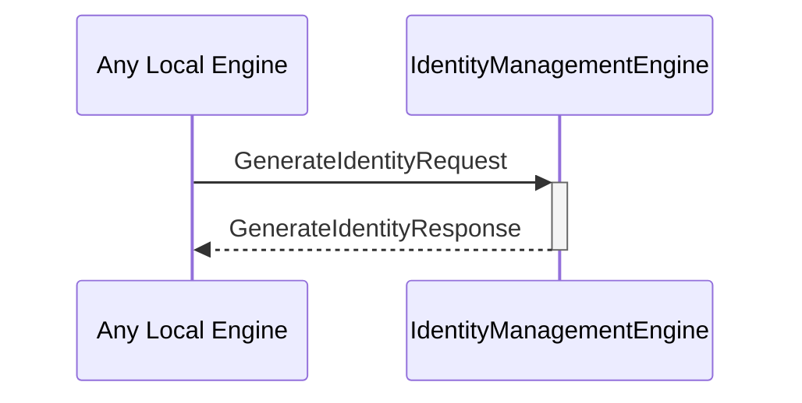

# GenerateIdentityRequest

# GenerateIdentityResponse

## Purpose

<!-- --8<-- [start:purpose] -->
A `GenerateIdentityRequest` instructs the identity management engine to generate a new identity using the specified backend.

A `GenerateIdentityResponse` provides the handles to decryption and commitment engine instances for a newly generated identity, or an error if a failure occurred.
<!-- --8<-- [end:purpose] -->

## Type

<!-- --8<-- [start:type] -->
[[GenerateIdentityRequest]]
[[GenerateIdentityResponse]]
<!-- --8<-- [end:type] -->

## Behavior

<!-- --8<-- [start:behavior] -->
- Uses the designated backend to generate a new identity
- Creates new commitment engine and decryption engine instances
- Returns handles to those instances in a [[GenerateIdentityResponse]]
<!-- --8<-- [end:behavior] -->

## Message flow

<!-- --8<-- [start:messages] -->

<!-- --8<-- [end:messages] -->

