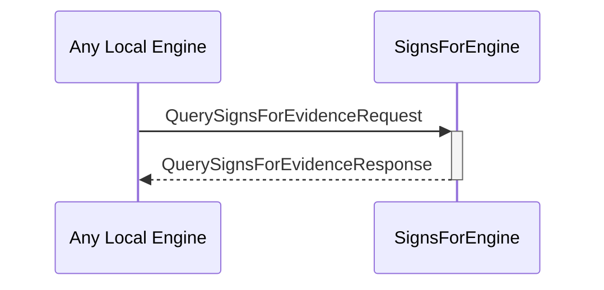

# QuerySignsForEvidenceRequest

# QuerySignsForEvidenceResponse

## Purpose

<!-- --8<-- [start:purpose] -->
A `QuerySignsForEvidenceRequest` instructs the signs-for engine to read and return the known signs-for evidence associated with a specific external identity.

A `QuerySignsForEvidenceResponse` is returned by the signs-for engine in response to a [[QuerySignsForEvidenceRequest]].
<!-- --8<-- [end:purpose] -->

## Type

<!-- --8<-- [start:type] -->
[[QuerySignsForEvidenceRequest]]
[[QuerySignsForEvidenceResponse]]
<!-- --8<-- [end:type] -->

## Behaviour

<!-- --8<-- [start:behaviour] -->
- Returns known evidence in a [[QuerySignsForEvidenceResponse]]
<!-- --8<-- [end:behaviour] -->

## Message flow

<!-- --8<-- [start:messages] -->

<!-- --8<-- [end:messages] -->

