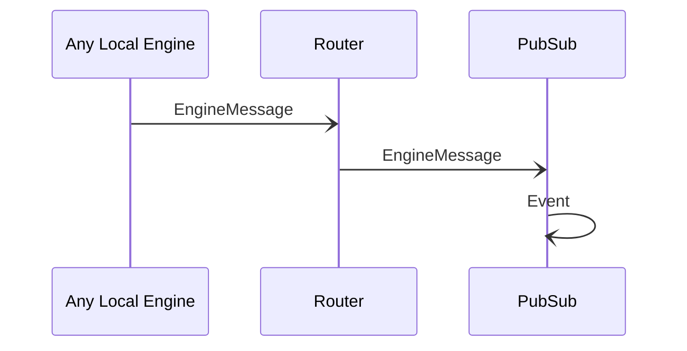

# EngineMessage 

## Purpose

<!-- --8<-- [start:purpose] -->
A message sent to a pub/sub topic by an engine.
<!-- --8<-- [end:purpose] -->

## Type

<!-- --8<-- [start:type] -->
**Reception:**

[[EngineMessageV1#enginemessagev1]]

--8<-- "../../../node/router/types/engine-message-v1.md:type"

**Triggers:**

[[Event#event]]
<!-- --8<-- [end:type] -->

## Behavior

<!-- --8<-- [start:behavior] -->
When a local engine sends an [[EngineMessage#enginemessage]] destined to a pub/sub topic,
the [[Router#router]] forwards it to all local engines subscribed to the message, including *PubSub*.

*PubSub* then encapsulates the message in an [[Event#event]],
and forwards it to its neighbors along the event dissemination path.
<!-- --8<-- [end:behavior] -->

## Message flow

<!-- --8<-- [start:messages] -->

<!-- --8<-- [end:messages] -->

