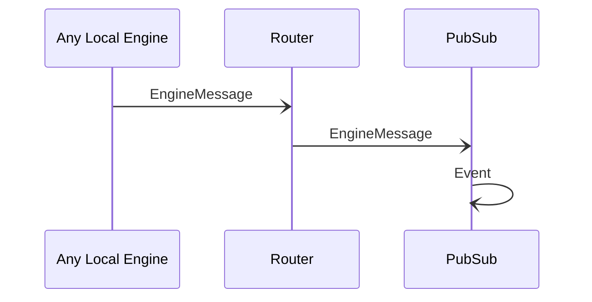

# EngineMessage {#enginemessage-pubsub}

## Purpose

<!-- ANCHOR: purpose -->
A message sent to a pub/sub topic by an engine.
<!-- ANCHOR_END: purpose -->

## Type

<!-- ANCHOR: type -->
**Reception:**

[[EngineMessageV1#enginemessagev1]]

{{#include ../../../node/router/types/engine-message-v1.md:type}}

**Triggers:**

[[Event#event]]
<!-- ANCHOR_END: type -->

## Behavior

<!-- ANCHOR: behavior -->
When a local engine sends an [[EngineMessage#enginemessage]] destined to a pub/sub topic,
the [[Router#router]] forwards it to all local engines subscribed to the message, including *PubSub*.

*PubSub* then encapsulates the message in an [[Event#event]],
and forwards it to its neighbors along the event dissemination path.
<!-- ANCHOR_END: behavior -->

## Message flow

<!-- ANCHOR: messages -->

<!-- ANCHOR_END: messages -->

