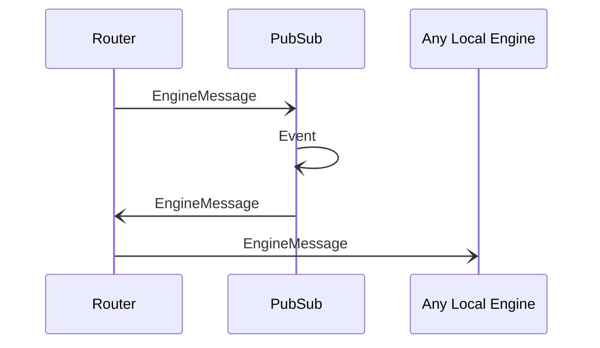

# Event

## Purpose

<!-- ANCHOR: purpose -->
An event sent to a topic.
<!-- ANCHOR_END: purpose -->

## Type

<!-- ANCHOR: type -->
**Reception:**

[[EventV1#eventv1]]

{{#include ../types/event-v1.md:type}}

**Triggers:**

*Event*

[[EngineMessage#enginemessage]]
<!-- ANCHOR_END: type -->

## Behavior

<!-- ANCHOR: behavior -->
The *Event* is forwarded in the network along topic dissemination paths.
It contains an encapsulated [[EngineMessage#enginemessage]] addressed from an engine to the topic.

The *PubSub* engine delivers the encapsulated [[EngineMessage#enginemessage]] to local engines
by sending it to the [[Router#router]], which forwards it to local engines subscribed to the topic.
<!-- ANCHOR_END: behavior -->

## Message flow

<!-- ANCHOR: messages -->

<!-- ANCHOR_END: messages -->
