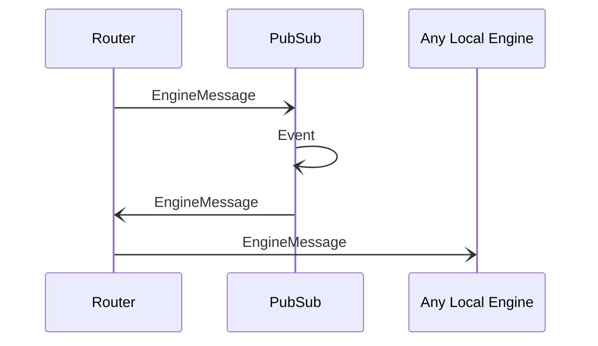

# Event

## Purpose

<!-- --8<-- [start:purpose] -->
An event sent to a topic.
<!-- --8<-- [end:purpose] -->

## Type

<!-- --8<-- [start:type] -->
**Reception:**

[[EventV1#eventv1]]

--8<-- "../types/event-v1.md:type"

**Triggers:**

*Event*

[[EngineMessage#enginemessage]]
<!-- --8<-- [end:type] -->

## Behavior

<!-- --8<-- [start:behavior] -->
The *Event* is forwarded in the network along topic dissemination paths.
It contains an encapsulated [[EngineMessage#enginemessage]] addressed from an engine to the topic.

The *PubSub* engine delivers the encapsulated [[EngineMessage#enginemessage]] to local engines
by sending it to the [[Router#router]], which forwards it to local engines subscribed to the topic.
<!-- --8<-- [end:behavior] -->

## Message flow

<!-- --8<-- [start:messages] -->

<!-- --8<-- [end:messages] -->
