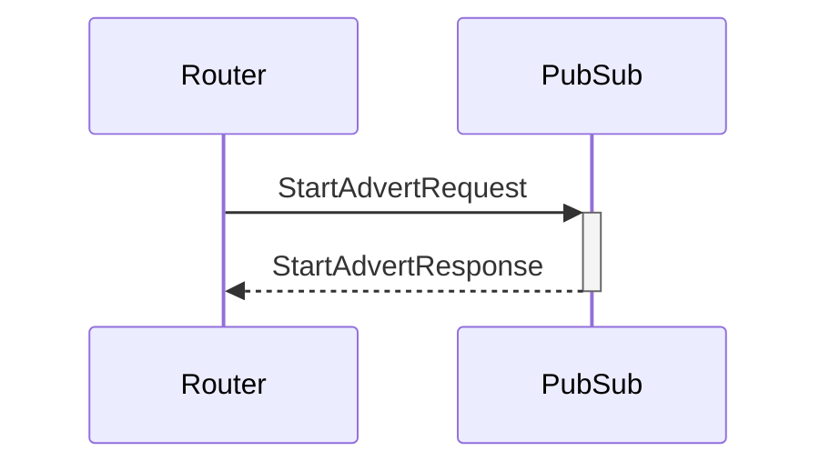

# StartAdvertRequest

## Purpose

<!-- --8<-- [start:purpose] -->
Start advertising a topic in the network.
<!-- --8<-- [end:purpose] -->

## Type

 <!-- --8<-- [start:type] -->
**Reception:**

[[TopicCreateRequestV1#topiccreaterequestv1]]

--8<-- "../../../node/router/types/topic-create-request-v1.md:type"

**Triggers:**

[[TopicResponseV1#topicresponsev1]]

--8<-- "../types/topic-response-v1.md:type"
<!-- --8<-- [end:type] -->

## Behaviour

<!-- --8<-- [start:behaviour] -->
Send [[TopicAdvert#topicadvert]] to connected neighbors in the domain.
<!-- --8<-- [end:behaviour] -->

## Message flow

<!-- --8<-- [start:messages] -->

<!-- --8<-- [end:messages] -->

