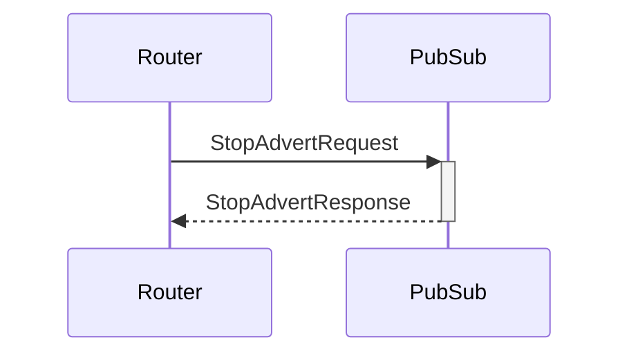

<!-- ANCHOR_END: purpose -->

# StopAdvertRequest

## Purpose

<!-- ANCHOR: purpose -->
Stop advertising a topic in the network.
<!-- ANCHOR_END: purpose -->

## Type

 <!-- ANCHOR: type -->
**Reception:**

[[TopicRequestV1#topicrequestv1]]

{{#include ../types/topic-request-v1.md:type}}

**Triggers:**

[[TopicResponseV1#topicresponsev1]]

{{#include ../types/topic-response-v1.md:type}}
<!-- ANCHOR_END: type -->

## Behavior

<!-- ANCHOR: behavior -->
<!-- ANCHOR_END: behavior -->

## Message flow

<!-- ANCHOR: messages -->

<!-- ANCHOR_END: messages -->

