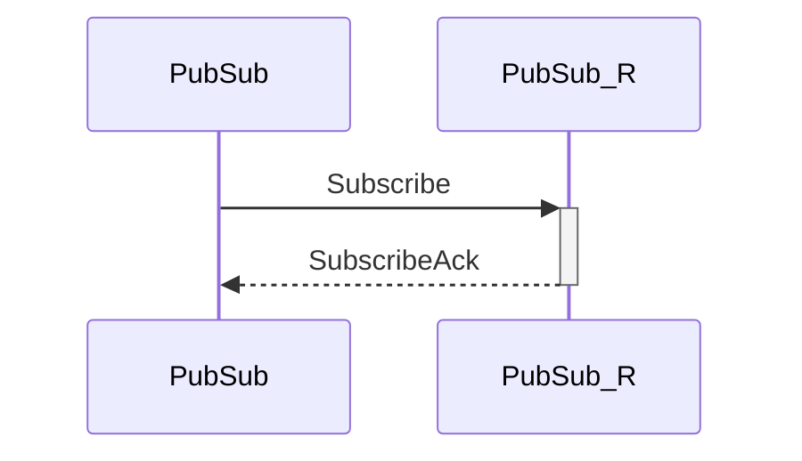

# SubscribeAck

## Purpose

<!-- ANCHOR: purpose -->
Subscription acknowledgement.
<!-- ANCHOR_END: purpose -->

## Type

 <!-- ANCHOR: type -->
**Reception:**

[[TopicRequestV1#topicrequestv1]]

{{#include ../types/topic-request-v1.md:type}}

**Triggers:**

[[TopicSubscribed#topicsubscribed]]

<!-- ANCHOR_END: type -->

## Behavior

<!-- ANCHOR: behavior -->
A [[TopicSubscribed#topicsubscribed]] notification is sent to local engines.
<!-- ANCHOR_END: behavior -->

## Message flow

<!-- ANCHOR: messages -->

<!-- ANCHOR_END: messages -->

