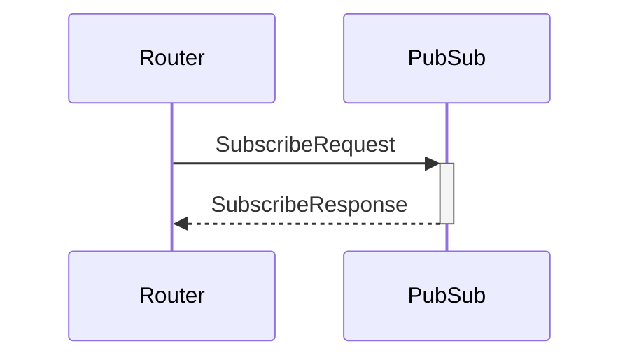

# SubscribeRequest

## Purpose

<!-- --8<-- [start:purpose] -->
Subscription request.
<!-- --8<-- [end:purpose] -->

## Type

 <!-- --8<-- [start:type] -->
**Reception:**

[[TopicRequestV1#topicrequestv1]]

{{#include ../types/topic-request-v1.md:type}}

**Triggers:**

[[TopicResponseV1#topicresponsev1]]

{{#include ../types/topic-response-v1.md:type}}
<!-- --8<-- [end:type] -->

## Behavior

<!-- --8<-- [start:behavior] -->
If not already subscribed, *PubSub* subscribes to the specified topic
by sending a P2P subscription request(s) to connected peers in the domain.
<!-- --8<-- [end:behavior] -->

## Message flow

<!-- --8<-- [start:messages] -->

<!-- --8<-- [end:messages] -->

