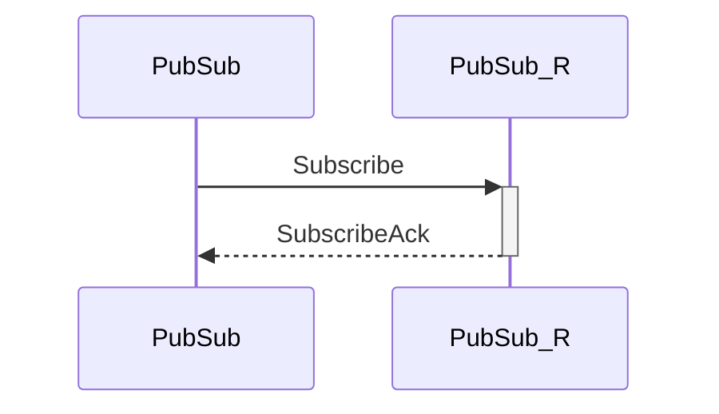

# Subscribe

## Purpose

<!-- ANCHOR: purpose -->
Subscribe to a topic at another peer.
<!-- ANCHOR_END: purpose -->

## Type

 <!-- ANCHOR: type -->
**Reception:**

[[TopicRequestV1#topicrequestv1]]

{{#include ../types/topic-request-v1.md:type}}

**Triggers:**

[[SubscribeAck#SubscribeAck]]

<!-- ANCHOR_END: type -->

## Behavior

<!-- ANCHOR: behavior -->
The peer the request arrived from is added to the [[PubSubRoutingTable#pubsubroutingtable]],
and a [[SubscribeAck#subscribeack]] is returned in response.
<!-- ANCHOR_END: behavior -->

## Message flow

<!-- ANCHOR: messages -->

<!-- ANCHOR_END: messages -->

