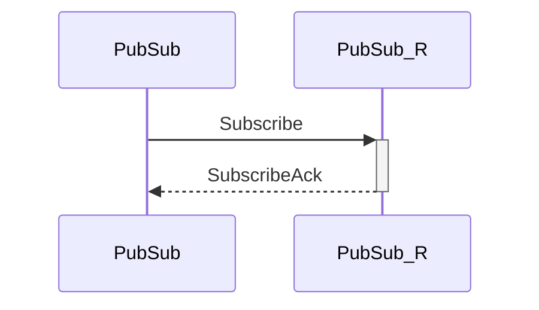

# Subscribe

## Purpose

<!-- --8<-- [start:purpose] -->
Subscribe to a topic at another peer.
<!-- --8<-- [end:purpose] -->

## Type

 <!-- --8<-- [start:type] -->
**Reception:**

[[TopicRequestV1#topicrequestv1]]

--8<-- "../types/topic-request-v1.md:type"

**Triggers:**

[[SubscribeAck#SubscribeAck]]

<!-- --8<-- [end:type] -->

## Behavior

<!-- --8<-- [start:behavior] -->
The peer the request arrived from is added to the [[PubSubRoutingTable#pubsubroutingtable]],
and a [[SubscribeAck#subscribeack]] is returned in response.
<!-- --8<-- [end:behavior] -->

## Message flow

<!-- --8<-- [start:messages] -->

<!-- --8<-- [end:messages] -->

