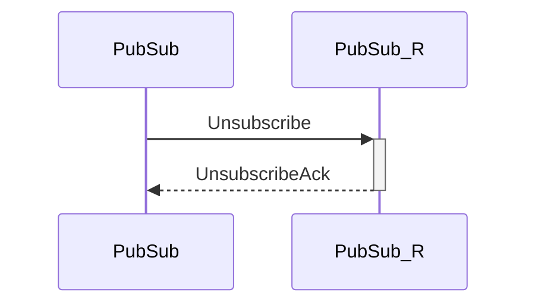

# UnsubscribeAck

## Purpose

<!-- --8<-- [start:purpose] -->
Unsubscription acknowledgement.
<!-- --8<-- [end:purpose] -->

## Type

 <!-- --8<-- [start:type] -->
**Reception:**

[[TopicRequestV1#topicrequestv1]]

{{#include ../types/topic-request-v1.md:type}}

**Triggers:**

[[ToicUnsubscribed#topicunsubscribed]]

<!-- --8<-- [end:type] -->

## Behavior

<!-- --8<-- [start:behavior] -->
A [[TopicUnsubscribed#topicunsubscribed]] notification is sent to local engines.
<!-- --8<-- [end:behavior] -->

## Message flow

<!-- --8<-- [start:messages] -->

<!-- --8<-- [end:messages] -->

