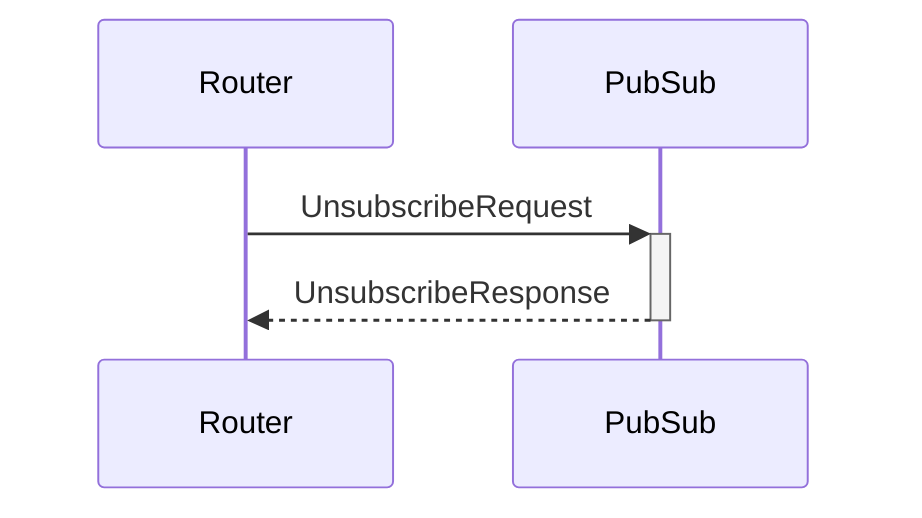

# UnsubscribeRequest

## Purpose

<!-- --8<-- [start:purpose] -->
Unsubscription request.
<!-- --8<-- [end:purpose] -->

## Type

 <!-- --8<-- [start:type] -->
**Reception:**

[[TopicRequestV1#topicrequestv1]]

--8<-- "../types/topic-request-v1.md:type"

**Triggers:**

[[TopicResponseV1#topicresponsev1]]

--8<-- "../types/topic-response-v1.md:type"
<!-- --8<-- [end:type] -->

## Behavior

<!-- --8<-- [start:behavior] -->
If subscribed to the given topic, PubSub unsubscribes from it by sending P2P unsubscription requests to connected peers.
<!-- --8<-- [end:behavior] -->

## Message flow

<!-- --8<-- [start:messages] -->

<!-- --8<-- [end:messages] -->

