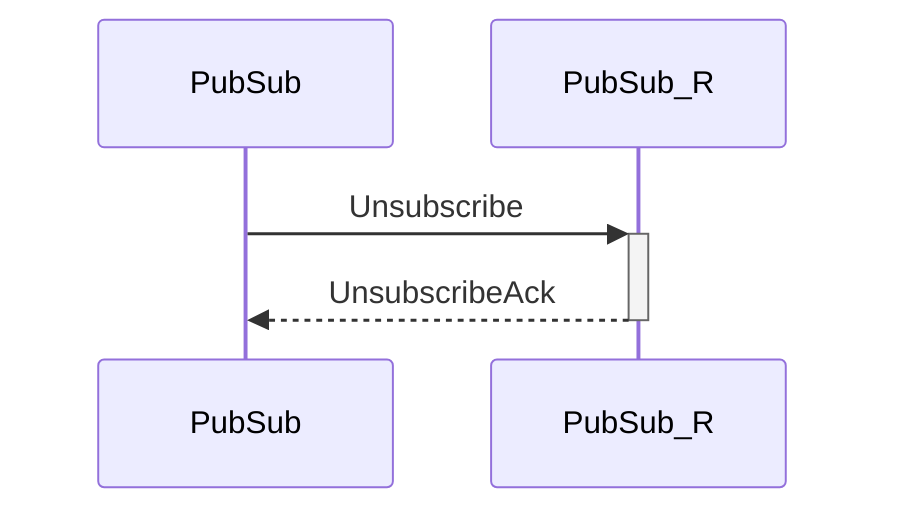

# Unsubscribe

## Purpose

<!-- ANCHOR: purpose -->
Unsubscribe from a topic at other peers.
<!-- ANCHOR_END: purpose -->

## Type

 <!-- ANCHOR: type -->
**Reception:**

[[TopicRequestV1#topicrequestv1]]

{{#include ../types/topic-request-v1.md:type}}

**Triggers:**

[[UnsubscribeAck#SubscribeAck]]

<!-- ANCHOR_END: type -->

## Behavior

<!-- ANCHOR: behavior -->
The peer the request arrived from is removed from the [[PubSubRoutingTable#pubsubroutingtable]],
and an [[UnsubscribeAck#unsubscribeack]] is returned in response.
<!-- ANCHOR_END: behavior -->

## Message flow

<!-- ANCHOR: messages -->

<!-- ANCHOR_END: messages -->

