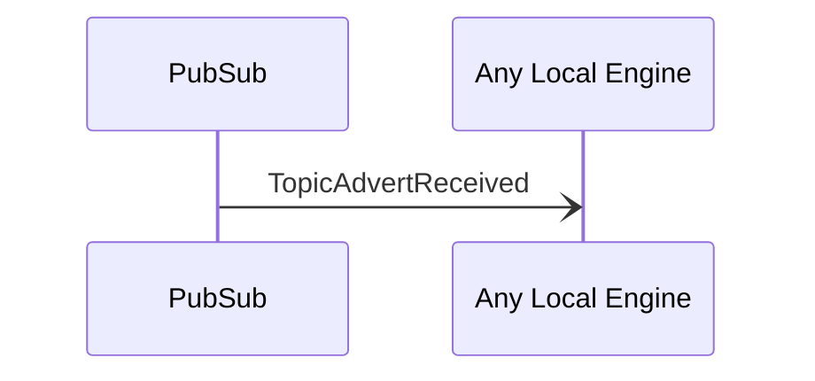

# TopicAdvertReceived

## Purpose

<!-- ANCHOR: purpose -->
A [[TopicAdvert]] has been received from another peer.
<!-- ANCHOR_END: purpose -->

## Type

 <!-- ANCHOR: type -->
[[TopicCreateRequestV1#topiccreaterequestv1]]

{{#include ../../../node/router/types/topic-create-request-v1.md:type}}
 <!-- ANCHOR_END: type -->

## Message flow

<!-- ANCHOR: messages -->

<!-- ANCHOR_END: messages -->

