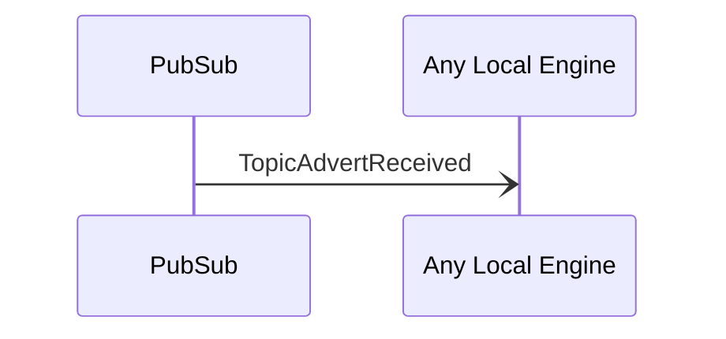

# TopicAdvertReceived

## Purpose

<!-- --8<-- [start:purpose] -->
A [[TopicAdvert]] has been received from another peer.
<!-- --8<-- [end:purpose] -->

## Type

 <!-- --8<-- [start:type] -->
[[TopicCreateRequestV1#topiccreaterequestv1]]

{{#include ../../../node/router/types/topic-create-request-v1.md:type}}
 <!-- --8<-- [end:type] -->

## Message flow

<!-- --8<-- [start:messages] -->

<!-- --8<-- [end:messages] -->

