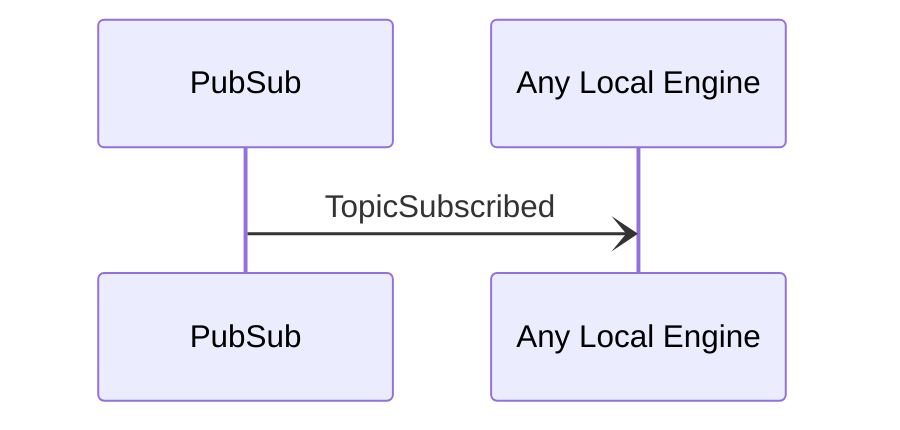

# TopicSubscribed

## Purpose

 <!-- --8<-- [start:purpose] -->
Notification about a topic that was successfully subscribed at another peer.
 <!-- --8<-- [end:purpose] -->

## Type

 <!-- --8<-- [start:type] -->
[[TopicRequestV1#topicrequestv1]]

--8<-- "../types/topic-request-v1.md:type"
 <!-- --8<-- [end:type] -->

## Message flow

<!-- --8<-- [start:messages] -->

<!-- --8<-- [end:messages] -->

