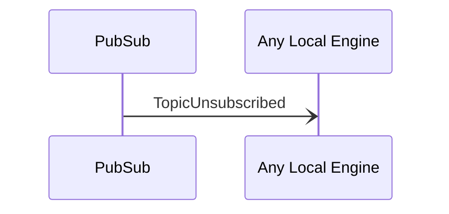

# TopicUnsubscribed

## Purpose

 <!-- ANCHOR: purpose -->
Notification about a topic that was successfully unsubscribed at another peer.
 <!-- ANCHOR_END: purpose -->

## Type

 <!-- ANCHOR: type -->
[[TopicRequestV1#topicrequestv1]]

{{#include ../types/topic-request-v1.md:type}}
 <!-- ANCHOR_END: type -->

## Message flow

<!-- ANCHOR: messages -->

<!-- ANCHOR_END: messages -->

